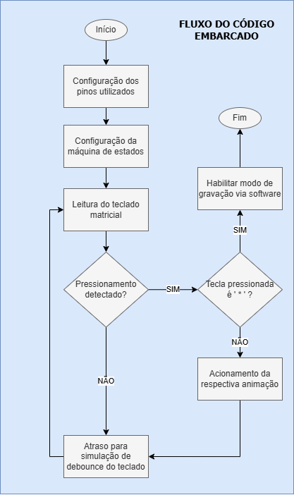

<h1 align="center">Animações em matriz de LEDS WS2812 para Raspberry Pi Pico W</h1>

## Sobre o projeto

O vídeo a seguir apresenta uma expplicação breve sobre o projeto.

## Colaboradores

### Líder

### Desenvolvedores

## Funcionalidades

O teclado matricial foi utilizado para a seleção das animações a serem exibidas na matriz de LEDS, assim como a habilitação do modo de gravação via software. Figura 1 apresenta a teclas
e as respectivas animações acionadas.

  <figure>  
    
    <figcaption>
      
 

**Figura 1** - Rotinas de acionamento para as teclas

    </figcaption>
  </figure>

## Circuito implementado
Para o desenvolvimento deste projeto, os seguintes componentes foram utilizados:
- 1 matriz de leds WS2812;
- 1 teclado matricial 4x4;
- 1 buzzer Passivo Eletromagnético MLT-8530 SMD 3.6V;
- 1 Raspberry Pi Pico W;
- 1 kit de desenvolvimento BitDogLab (para teste em hardware físico).

A Figura 2 apresenta o circuito implementado por meio da ferramenta de simulação Wokwi para VSCode. Por sua vez, Figura 3 lista a relação dos pinos utilizados para cada um dos componentes.

  <figure>  
    
    <figcaption>
      
 

**Figura 2** - Circuito implementado no Wokwi para VSCode

    </figcaption>
  </figure>

  <figure>  
    
    <figcaption>
      
 

**Figura 3** - Relação de pinos utilizados

    </figcaption>
  </figure>

## Arquitetura do projeto

A Figura 4 apresenta o diagrama em blocos da arquitetura do projeto. O software embarcado conta com três blocos principais: i) gerenciamento de hardware: responsável pela configuração
dos pinos e por proporcionar uma interface para a utilização dos hardwares utilizando a [Raspberry Pi SDK](https://github.com/raspberrypi/pico-sdk); ii) gerenciamento da máquina de estados PIO: responsável pela configuração da máquina de estados usada para 
o controle da WS2812; iii) gerenciamento de animações: responsável pela implementação das animações. 

  <figure>  
    
    <figcaption>
      
 

**Figura 4** - Diagrama em blocos do projeto

    </figcaption>
  </figure>

Por fim, a Figura 5 apresenta o fluxograma do software embarcado. Primeiramente, os pinos utilizados para o controle dos componentes eletrônicos, assim como
a máquina de estados, são inicializados e configurados. Após, a rotina de polling do teclado matricial é iniciada. Caso uma tecla seja pressionada, a respectiva
animação é executada (ou a gravação por software é habilitada) e, em seguida o programa retorna para o polling das teclas. Caso contrário, o programa reinicia o processo de detecção. 
A fim de corrigir o fenômeno de bouncing das teclas, um atraso de 200 ms foi adicionado ao loop mais externo do programa (loop principal).

  <figure>  
    
    <figcaption>
      
 

**Figura 5** - Fluxograma do projeto

    </figcaption>
  </figure>

